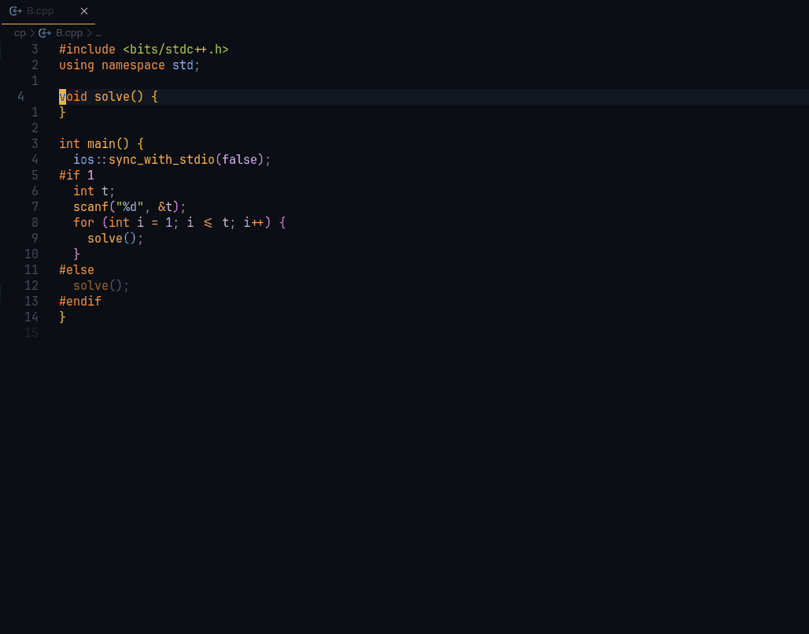

<h3 align="center">⚡ Fast Olympic Coding ⚡</h3>


Fast Olympic Coding is an extension to assist with various common tasks in competitive programming. It is a ported and enhanced version of the corresponding Sublime Text plugin by integrating various VSCode functionalities.

⚡ What other goodies does this extension offer?
  - Concurrently run, edit, and delete multiple testcases
  - Heavily optimized: avoid any unnecessary re-rendering, batching `stdout` and `stderr` messages, etc...

### Interested? _[INSTALL](#how-to-install) AND [SET IT UP](#setting-up) RIGHT NOW!_

---

### Keybinds
- Compile (only if file changed) and run all testcases: `Ctrl+Alt+B`
- Compile (Always) and run all testcases: `Ctrl+Alt+G`
- Delete all testcases: `Ctrl+Alt+D`
- Insert file template: `Ctrl+Alt+I`
  - Control if the content should be folded `fastolympiccoding.foldFileTemplate` (**Default: `true`**)

---

### Todo
- Documentation on settings
- Integration with [Competitive Companion](https://github.com/jmerle/competitive-companion)
  - Problem parser (and maybe contest parser)
- Stress tester
- "Emmet" for class types (`Class Completion` functionality in original plugin)

---

### How to Install
- VSCode Marketplace: [Fast Olympic Coding](https://marketplace.visualstudio.com/items?itemName=sam20908.vscode-fastolympiccoding)
- Command in Quick Open (`Ctrl+P`): `ext install sam20908.vscode-fastolympiccoding`

---

### Setting Up
Provide run settings for the languages you use in `settings.json`. Here are some examples for C++, Python, and Java:
```json
{
  "fastolympiccoding.runSettings": {
    ".cpp": {
      "compileCommand": "g++ -std=gnu++20 -D_GLIBCXX_DEBUG ${file} -o ${fileDirname}/${fileBasenameNoExtension}${exeExtname} -fdiagnostics-color=always",
      "runCommand": "${fileDirname}/${fileBasenameNoExtension}${exeExtname}"
    },
    ".py": {
      "runCommand": "python ${file}"
    },
    ".java": {
      "compileCommand": "javac ${file}",
      "runCommand": "java -cp ${fileDirname} ${fileBasenameNoExtension}"
    }
  }
}
```

- We can use [VSCode's built-in variables](https://code.visualstudio.com/docs/editor/variables-reference) as well as `${exeExtname}` that resolves into `.exe` for Windows and an empty string for other platforms. 
- Forward/backward slashes are automatically normalized when being executed.

---

### Testcase Window
- The extension will load the saved testcases for the opened file, and the testcases will automatically update whenever you switch files.
- Accept outputs to detect wrong answers later!


- Compilation errors will be displayed in a popup window.


- Very long outputs will be truncated (adjustable character limit at `fastolympiccoding.maxCharactersForOutput`)


---

### Other Goodies
- Insert code from a pre-written library and automatically folded by VSCode!



---

### Attributions

- [FastOlympicCoding](https://github.com/Jatana/FastOlympicCoding): The original Sublime Text package that inspired this extension 💖
- [Flaticon](https://www.flaticon.com/): Icon for this extension 💖