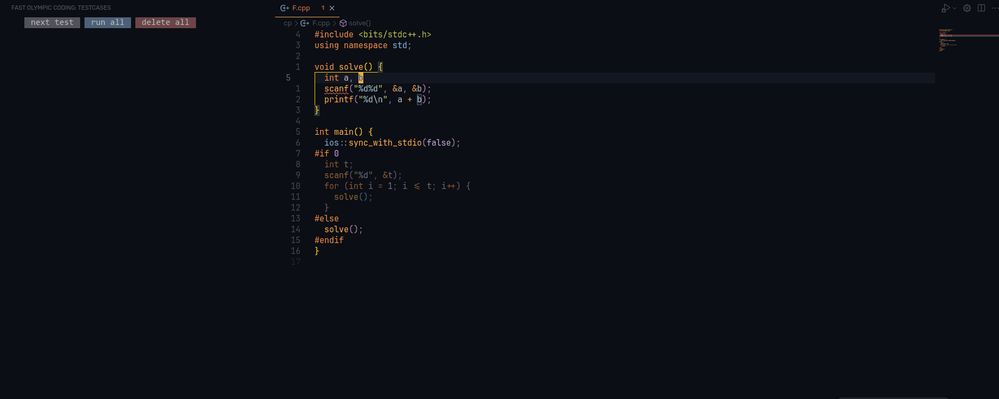

<h3 align="center">⚡ Fast Olympic Coding ⚡</h3>


Fast Olympic Coding is an extension to assist with various common tasks in competitive programming. It is a ported and enhanced version of the corresponding Sublime Text plugin by integration various VSCode functionalities.

⚡ What other goodies does this extension offer?
  - Concurrently run, edit, and delete multiple testcases
  - Heavily optimized: avoid any unnecessary re-rendering, batching `stdout` and `stderr` messages, etc...

*Full credit goes to the original Sublime Text plugin https://github.com/Jatana/FastOlympicCoding*

### Interested? _[INSTALL](#how-to-install) AND [SET IT UP](#setting-up) RIGHT NOW!_

---

### How to Install
- Via VSCode Marketplace: [Fast Olympic Coding](https://marketplace.visualstudio.com/items?itemName=sam20908.vscode-fastolympiccoding)
- Via a command in Quick Open (`Ctrl+P`): `ext install sam20908.vscode-fastolympiccoding`

---

### Todo
- Documentation on settings
- Integration with [Competitive Companion](https://github.com/jmerle/competitive-companion)
  - Problem parser (and maybe contest parser)
- Stress tester
- "Emmet" for class types (`Class Completion` functionality in original plugin)
- File snippets (`Auto` function in original plugin)

### Not Planned
- Built-in linter. Please use another extension like [Microsoft's C/C++ Extension](https://marketplace.visualstudio.com/items?itemName=ms-vscode.cpptools).

---

### Setting Up
Provide settings for the languages you use in `settings.json`. Here are some example configurations for C++, Python, and Java:
```json
{
  "fastolympiccoding.runSettings": {
    ".cpp": {
      "compileCommand": "g++ -std=gnu++20 -D_GLIBCXX_DEBUG ${file} -o ${fileDirname}/${fileBasenameNoExtension}${exeExtname} -fdiagnostics-color=always",
      "runCommand": "${fileDirname}/${fileBasenameNoExtension}${exeExtname}"
    },
    ".py": {
      "runCommand": "python ${file}"
    },
    ".java": {
      "compileCommand": "javac ${file}",
      "runCommand": "java -cp ${fileDirname} ${fileBasenameNoExtension}"
    }
  }
}
```

- We can use all of [VSCode's built-in variables](https://code.visualstudio.com/docs/editor/variables-reference) and a custom `${exeExtname}` to resolve into `.exe` for Windows and an empty string for other platforms. 
- Forward/backward slashes are automatically normalized for the platform.

---

### Testcases
- The extension will load the saved testcases for the opened file, and the testcases will automatically update whenever you switch files.

- Accept outputs to detect wrong answers later!


- Any compilation errors will be displayed in a terminal.



- Super long outputs will be truncated automatically (limit can be adjusted in settings)

