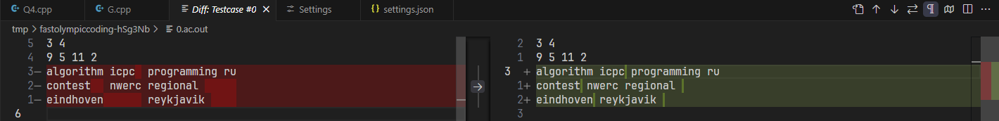
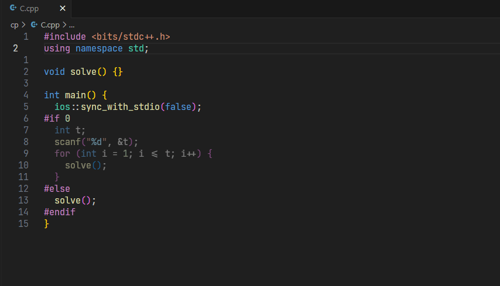
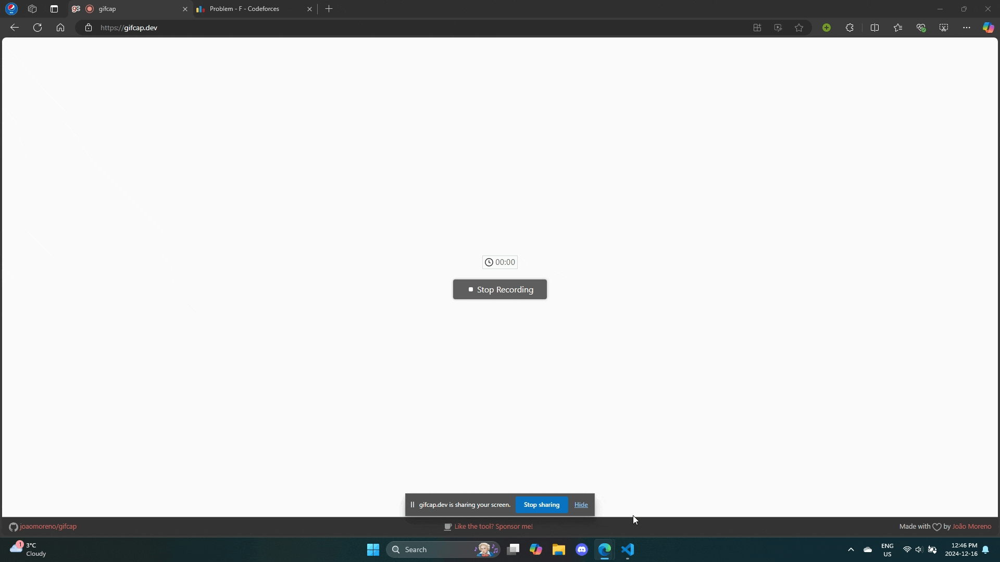

<h3 align="center">⚡ Fast Olympic Coding ⚡</h3>


<p align="center">


</p>

Fast Olympic Coding is an extension to assist with various tasks in competitive programming. It is a ported and enhanced version of the corresponding Sublime Text plugin that also leverages the power of VSCode.

### ⚡ Overview

  - [📜](#-testcase-window) Concurrently run, edit, and delete multiple testcases
  - [👨🏻‍💻](#-stress-tester) Stress tester to find counterexamples
  - [👜](#-inserting-prewritten-code) Insert pre-written code from another file with automatic folding
  - [🛜](#-competitive-companion) Reads contests and problems from [Competitive Companion](https://github.com/jmerle/competitive-companion)
  - 🏃 ***BLAZINGLY FAST!*** Asynchronous design + optimizations = **99%** spam proof!

### 💻 Keybinds

- Compile (if file has compile command and file had changed) and run all testcases: `Ctrl+Alt+B`
- Stop all testcases: `Ctrl+Alt+K`
- Delete all testcases: `Ctrl+Alt+D`
- Run stress test: `Ctrl+Alt+G`
- Insert file template: `Ctrl+Alt+I`

### 📥 Install within VSCode or at  [Visual Studio Marketplace](https://marketplace.visualstudio.com/items?itemName=sam20908.vscode-fastolympiccoding)
---

### </> Setting Up

Provide run settings for the languages you use in `settings.json`. Here are some examples for C++, Python, and Java:
```json
{
  "fastolympiccoding.runSettings": {
    ".cpp": {
      "compileCommand": "g++ -std=gnu++20 -D_GLIBCXX_DEBUG ${path:${file}} -o ${path:${fileDirname}/${fileBasenameNoExtension}${exeExtname}}",
      "runCommand": "${path:${fileDirname}/${fileBasenameNoExtension}${exeExtname}}"
    },
    ".py": {
      "runCommand": "python ${path:${file}}"
    },
    ".java": {
      "compileCommand": "javac ${path:${file}}",
      "runCommand": "java -cp ${fileDirname} ${fileBasenameNoExtension}"
    }
  }
}
```

We can use the following variables in the syntax of `${...}`
- Most of [VSCode's built-in variables](https://code.visualstudio.com/docs/editor/variables-reference)
- `${exeExtname}` returns `.exe` for Windows and an empty string for other platforms
- `${path:*some value*}` turns \*some value\* into a valid path string for the current platform, which normalizes slashes and handles spaces

<details>
  <summary>Possible settings per language</summary>

  - `compileCommand` (optional): Command to run before `runCommand`
  - `runCommand`: Command to run the solution
  - `currentWorkingDirectory` (optional): sets the current working directory for `runCommand`
</details>

---

### 📜 Testcase Window

- Accepting the testcases' answers
- Show/hide the testcases' details
- View full text of visually shortened stdin/stderr/stdout/accepted stdout by clicking on their corresponding arrows
- ... and so much more!


You can also view wrong answers in a diff view.




---

### 👨🏻‍💻 Stress Tester

Required files (naming scheme can be configured in settings):
- `<name>.[ext]`: the solution to bruteforce against
- `<name>__Good.[ext]`: the solution that outputs the correct answer
- `<name>__Generator.[ext]`: to generate inputs for the other 2 files
  - **The extension provides a 64-bit integer seed input for random number generators!**

<figure>
  
  <figcaption>Stress Tester was able to find an counterexample due to an integer overflow bug!</figcaption>
</figure>

---

### 👜 Inserting Prewritten Code

- Add the root directory of the templates to the settings
- Remove trailing newlines for fold to work (folding is optional via settings)

<figure>
  
  <figcaption>Adding a tree reroot DP template without switching files.</figcaption>
</figure>

---

### 🛜 Competitive Companion

- **NOTE: Open the extension to start the listening process!**

<figure>
  
  <figcaption>Using Competitive Companion to parse a CodeForces problem.</figcaption>
</figure>

<figure>
  
  <figcaption>We can parse an entire CodeForces Div.3 Contest!</figcaption>
</figure>

---

### © Attributions

- [FastOlympicCoding](https://github.com/Jatana/FastOlympicCoding): The original Sublime Text package that inspired this extension 💖
- [Flaticon](https://www.flaticon.com/): Icon for this extension 💖
