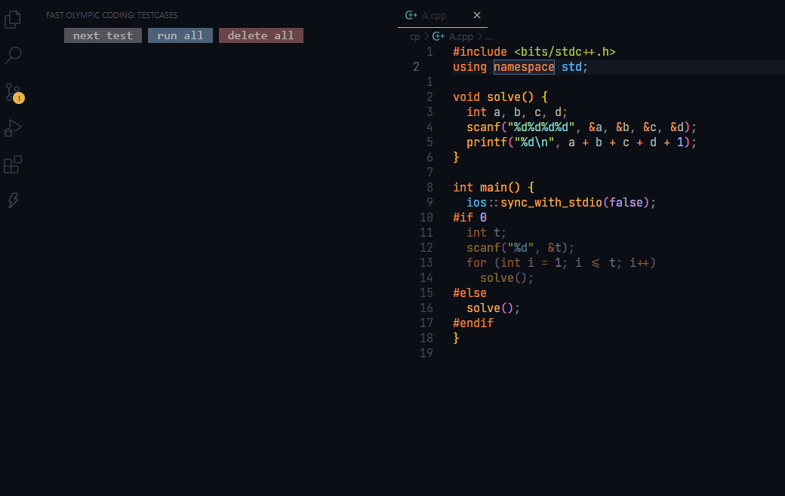

# Fast Olympic Coding



Fast Olympic Coding is an extension to assist with various common tasks in competitive programming. It is a ported and enhanced version of the corresponding Sublime Text plugin by integration various VSCode functionalities.

*Full credit goes to the original Sublime Text plugin https://github.com/Jatana/FastOlympicCoding*

### _Interested? [LEARN HOW TO USE RIGHT NOW!](#setting-up)_

#### Features
- Testcases

#### Todo
- Documentation on file variables
- Time limit
- Stress tester
- Solution checker (*permutation problems zzzzzzzz...*)
- "Emmet" of class types (`Class Completion` functionality in original plugin)
- File snippets (`Auto` function in original plugin)
- Debugger integration

#### Not Planned
- Built-in linter, because the official C/C++ extension can do it

## Setting Up
- Any language can work, provided that your have settings for for it in your own `settings.json`. Here are some example configurations:
```json
{
  "fastolympiccoding.runSettings": {
    ".cpp": {
      "compileCommand": "g++ -std=gnu++20 -D_GLIBCXX_DEBUG ${file} -o ${compiledFile} -fdiagnostics-color=always",
      "runCommand": "./${compiledFile}"
    },
    ".py": {
      "runCommand": "python ${file}"
    }
  }
}
```

Notice that we can use all of [VSCode's built-in variables](https://code.visualstudio.com/docs/editor/variables-reference) and a custom one `${compiledFile}`, which resolves to the full path of the compiled file. The commands are normalized, meaning there's no need to worry about different path separators.

### Testcases
When you open any file, the extension will load the saved testcases for that file, and the testcases view will automatically update whenever you switch files.

Multiple limitations have been addressed, such as running, editing, and deleting multiple testcases at the same time.

If the language requires compilation and it fails, it will be displayed in a terminal window. Colors are supported given that the compile command outputs it.

