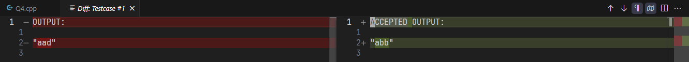

<h3 align="center">⚡ Fast Olympic Coding ⚡</h3>


<p align="center">


</p>

Fast Olympic Coding is an extension to assist with various tasks in competitive programming. It is a ported and enhanced version of the corresponding Sublime Text plugin that also leverages the power of VSCode.

### ⚡ Overview

  - [📜](#-testcase-window) Concurrently run, edit, and delete multiple testcases
  - [👨🏻‍💻](#-stress-tester) Stress tester to find counterexamples
  - [👜](#-inserting-prewritten-code) Insert pre-written code from another file with automatic folding
  - [🛜](#-competitive-companion) Reads contests and problems from [Competitive Companion](https://github.com/jmerle/competitive-companion)
  - 🏃 ***BLAZINGLY FAST!*** Asynchronous design + optimizations = **99%** spam proof!

### 💻 Keybinds

- Compile: `Ctrl+Alt+C`
- Compile and run all testcases: `Ctrl+Alt+B`
- Stop all testcases: `Ctrl+Alt+K`
- Delete all testcases: `Ctrl+Alt+D`
- Save all testcases: `Ctrl+Alt+S`
- Run stress test: `Ctrl+Alt+G`
- Stop stress test: `Ctrl+Alt+H`
- Insert file template: `Ctrl+Alt+I`

### 📥 Install within VSCode or at  [Visual Studio Marketplace](https://marketplace.visualstudio.com/items?itemName=sam20908.vscode-fastolympiccoding)
---

### </> Setting Up

Provide run settings for the languages you use in `settings.json`. Here are some examples for C++, Python, and Java:
```json
{
  "fastolympiccoding.runSettings": {
    ".cpp": {
      "compileCommand": "g++ -std=gnu++20 -D_GLIBCXX_DEBUG ${path:${file}} -o ${path:${fileDirname}/${fileBasenameNoExtension}${exeExtname}}",
      "runCommand": "${path:${fileDirname}/${fileBasenameNoExtension}${exeExtname}}"
    },
    ".py": {
      "runCommand": "python ${path:${file}}"
    },
    ".java": {
      "compileCommand": "javac ${path:${file}}",
      "runCommand": "java -cp ${fileDirname} ${fileBasenameNoExtension}"
    }
  }
}
```

We can use the following variables in the syntax of `${...}`
- Most of [VSCode's built-in variables](https://code.visualstudio.com/docs/editor/variables-reference)
- `${exeExtname}` returns `.exe` for Windows and an empty string for other platforms
- `${path:*value*}` normalizes \*value\* into a valid path string for the current platform

<details>
  <summary>Settings per language</summary>

  - `compileCommand` (optional): Command to run before `runCommand` when the file content changed
  - `runCommand`: Command to run the solution
  - `currentWorkingDirectory` (optional): sets the current working directory for `runCommand`
</details>

---

### 📜 Testcase Window

#### 📄 Other features include...
- Show/hide the testcase details
- Shortened details of testcases for huge outputs
  - **View full text by clicking on their corresponding arrows**
- Color supported output for compile errors
- ... and so much more!


|  |
| :-----------------------------------: |
| *View wrong answers in a diff view!*  |

<details>
  <summary>General setting for both Testcase Window and Stress Tester</summary>

  - `font`: Font family used to render text (restart extension to apply)
  - `runSettings`: Object of [run settings](#-setting-up)
  - `maxDisplayCharacters`: Maximum number of characters to display for each output
  - `maxDisplayLines`: Maximum number of lines to display for each output
</details>

---

### 👨🏻‍💻 Stress Tester

Required files (naming scheme can be configured in settings):
- `<name>.[ext]`: the solution to bruteforce against
- `<name>__Good.[ext]`: the solution that outputs the correct answer
- `<name>__Generator.[ext]`: to generate inputs for the other 2 files
  - **The extension provides a 64-bit integer seed input for random number generators!**

- **💡TIP**: To stress test for **Runtime Error** instead of **Wrong Answer**, have the good solution be the same as the one to bruteforce against!

|                                       |
| :--------------------------------------------------------------------------------: |
| *Stress Tester was able to find an counterexample due to an integer overflow bug!* |

<details>
  <summary>Settings for Stress Tester</summary>

  - `goodSolutionFile`: Full path for good solution file (supports `${...}`)
  - `generatorFile`: Full path for generator file (supports `${...}`)
  - `delayBetweenTestcases`: Amount of delay between generated testcases in milliseconds **(minimum: `5`)**
  - `stressTestcaseTimeLimit`: Maximum time in milliseconds the Stress Tester is allowed to spend on one testcase **(`0` for no limit)**
  - `stressTimeLimit`: Maximum time in milliseconds the Stress Tester is allowed to run **(`0` for no limit)**
</details>

---

### 👜 Inserting Prewritten Code

- Add the root directory of the templates to the settings
- **NOTE**: Remove trailing newlines for fold to work (folding is optional via settings)
  - Folding depends on VSCode support, which may require other extensions depending on the language.

|  |
| :---------------------------------------------------------: |
| *Adding a tree reroot DP template without switching files*  |

<details>
  <summary>Possible settings</summary>

  - `fileTemplatesBaseDirectory`: Full path to the base directory of all prewritten files (supports `${...}`)
  - `fileTemplatesDependencies` (optional): Maps a template path relative to base directory to a list of other relative template paths that this one depends on
  - `foldFileTemplate` (default: `false`): Whether to fold the newly inserted prewritten code
</details>

---

### 🛜 Competitive Companion

- **Open the extension to start the listening process!**

|            |
| :---------------------------------------------------------: |
| *Using Competitive Companion to parse a CodeForces problem* |

|   |
| :------------------------------------------------: |
| *We can parse an entire CodeForces Div.3 Contest!* |

<details>
  <summary>Settings for Competitive Companion integration</summary>

  - `openSelectedFiles` (default: `true`): Whether to open all the selected files
  - `askForWhichFile` (default: `false`): Ask for which file to write testcase onto, even when a file is currently opened and only a single problem has been received
  - `includePattern` (default: `**/*`): Glob pattern to filter in the included files for asking prompt
  - `excludePattern` (default: *empty*): Glob pattern to filter out the included files for asking prompt
  - `port` (default: *1327*): Port number to listen from Competitive Companion
</details>

---

### © Attributions

- [FastOlympicCoding](https://github.com/Jatana/FastOlympicCoding): The original Sublime Text package that inspired this extension 💖
- [Flaticon](https://www.flaticon.com/): Icon for this extension 💖
