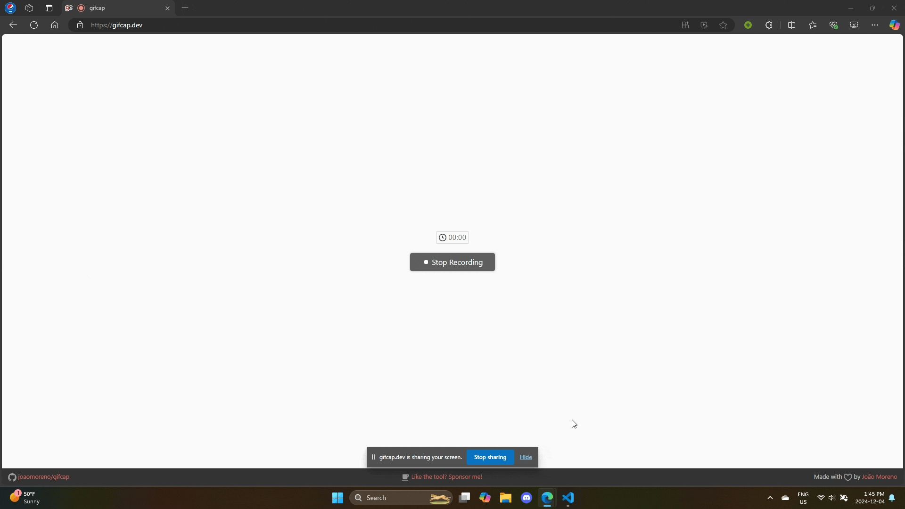

<h3 align="center">⚡ Fast Olympic Coding ⚡</h3>


<p align="center">


</p>

Fast Olympic Coding is an extension to assist with various tasks in competitive programming. It is a ported and enhanced version of the corresponding Sublime Text plugin that also leverages the power of VSCode.

### ⚡ Overview

  - [📜](#-testcase-window) Concurrently run, edit, and delete multiple testcases
  - [👨🏻‍💻](#-stress-tester) Stress tester to find counterexamples
  - [👜](#-inserting-prewritten-code) Insert pre-written code from another file with automatic folding
  - [🛜](#-competitive-companion) Reads testcases and outputs from [Competitive Companion](https://github.com/jmerle/competitive-companion) onto the current file
  - 🏃 ***BLAZINGLY FAST!*** Asynchronous design + optimizations = **99%** spam proof!

### 💻 Keybinds

- Compile (if file has compile command and file had changed) and run all testcases: `Ctrl+Alt+B`
- Run stress test: `Ctrl+Alt+G`
- Delete all testcases: `Ctrl+Alt+D`
- Insert file template: `Ctrl+Alt+I`

### 📥 Installation: [Visual Studio Marketplace](https://marketplace.visualstudio.com/items?itemName=sam20908.vscode-fastolympiccoding)
---

### </> Setting Up

Provide run settings for the languages you use in `settings.json`. Here are some examples for C++, Python, and Java:
```json
{
  "fastolympiccoding.runSettings": {
    ".cpp": {
      "compileCommand": "g++ -std=gnu++20 -D_GLIBCXX_DEBUG ${file} -o ${fileDirname}/${fileBasenameNoExtension}${exeExtname} -fdiagnostics-color=always",
      "runCommand": "${fileDirname}/${fileBasenameNoExtension}${exeExtname}"
    },
    ".py": {
      "runCommand": "python ${file}"
    },
    ".java": {
      "compileCommand": "javac ${file}",
      "runCommand": "java -cp ${fileDirname} ${fileBasenameNoExtension}"
    }
  }
}
```
- **Make sure the directory for your compiled file exists!**
- We can use [VSCode's built-in variables](https://code.visualstudio.com/docs/editor/variables-reference) as well as `${exeExtname}` that resolves into `.exe` for Windows and an empty string for other platforms. 
- Forward/backward slashes are automatically normalized when being executed.

---

### 📜 Testcase Window


---

### 👨🏻‍💻 Stress Tester

Required files (naming scheme configurable in settings):
- `<name>.[ext]`: the solution to bruteforce against
- `<name>__Good.[ext]`: the solution that outputs the correct answer
- `<name>__Generator.[ext]`: to generate inputs for the other 2 files

*Gif is recorded at 15FPS but the tester runs as low as 5ms between testcases!*


---

### 👜 Inserting Prewritten Code

- **Specify your library directory in settings to enable this functionality. Otherwise, nothing happens!**
- **Make sure there is no newlines at the end of your templates for the folding to work!**



---

### 🛜 Competitive Companion

- **Open the extension's tab on VSCode's sidebar to activate the process of listening for Competitive Companion first!**


---

### © Attributions

- [FastOlympicCoding](https://github.com/Jatana/FastOlympicCoding): The original Sublime Text package that inspired this extension 💖
- [Flaticon](https://www.flaticon.com/): Icon for this extension 💖
